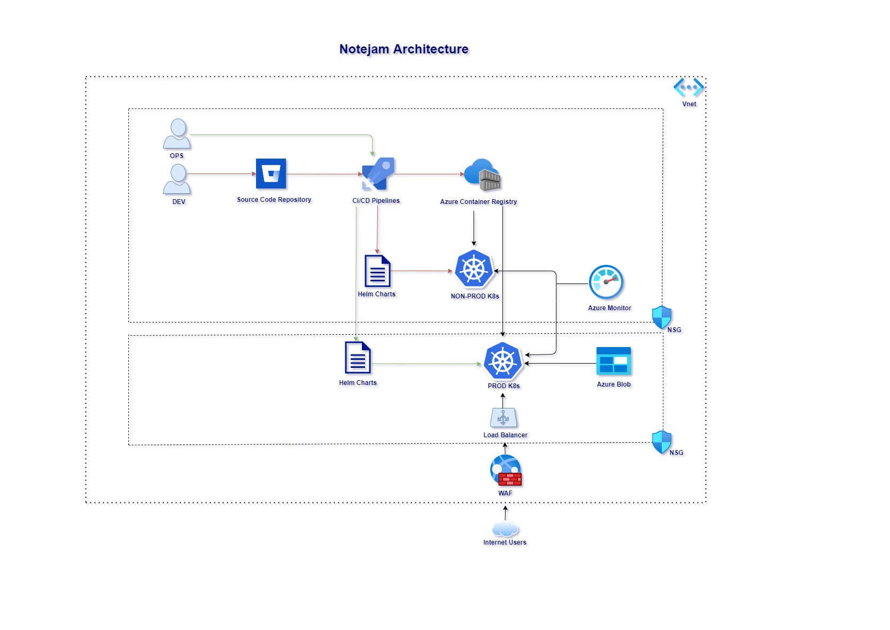

## Scenario

The customer, you are working with, asks you to *create a pilot for one of the company’s applications in public cloud
running in Kubernetes. This is their first attempt to getting to know with non-on-prem environments so your
responsibility is not only delivering the solution but to present and highlight core concepts and benefits of the
designed architecture. The customer has no preferences on which cloud to go, please choose one of the major cloud
providers Azure/AWS/GCP.

## Business requirements

- The Application must serve variable amount of traffic. Most users are active during business hours. During big events and conferences the traffic could be 4 times more than typical.
- The Customer takes guarantee to preserve your notes up to 3 years and recover it if needed.
- The Customer ensures continuity in service in case of datacenter failures.
- The Service must be capable of being migrated to any regions supported by the cloud provider in case of emergency.
- The Customer is planning to have more than 100 developers to work in this project who want to roll out multiple deployments a day without interruption / downtime.
- The Customer wants to provision separated environments to support their development process for development, testing, production in the near future.
- The Customer wants to see relevant metrics and logs from the infrastructure for quality assurance and security purposes.

## New Solution

The proposed solution is on Azure with GitOps in AKS (PROD and non-PROD) cluster.

## Architecture

The solution can be divided into 3 sections.
1. Dev
   - The developers will commit codes in their source repository, Azure CI/CD pipeline will initate an image build using Dockerfile mentioned in the repository. 
   - The newly build image is been moved to Azure container registry.
   - Developers can create CD pipeline for new helm charts that need to be deployed in non-PROD Kubernetes cluster.
2. Ops
   - The Ops team can initate a new CD pipeline in PROD Kuberenetes cluster once Dev team succsffully verified application in non-PROD cluster.
3. External Users
   - Internet users can access application via a webURL (eg:- https://test5.example.com) on their web browser.
   - Traffic will flow from internet to Azure WAF and then to a load balancer which will inturn hit haproxy ingress controller and provide the web page contents from Kubernetes pods/services as listed in ingress resources.

Azure Log Analytics workspace can help to log data from Azure Monitor which acts as a central source for metrics and logs. The Log Analytics Workspace helps in creating customizable dashboards which helps to customers to view any metrics in charts or graphs form. Monitoring also can be enabled using Log Analytics which will trigger any alerts based on the metrics that are being collected.

Azure blob storage is connected to PROD Kubernetes cluster for taking backup of necessary resources.
          

The notejam application in new architecture can be implemented on Kubernetes as two deployments, one with notejam application and second one with any robust database (MySQL/PostgreSQL etc.). Network policy need to be implemented to secure deployments. 

## Directory Structure
   - 01-architecture
     - The directory contains 2 above architecture diagrams.
   - 02-docker
     - The directory contains notejam django application with Dockerfile
   - 03-kubernetes
     - The directory contains ansible playbooks to create AKS and container registry (Source: Microsoft and Ansible Websites)
   - 04-helm-charts
     - The directory contains helm charts for notejam application and metrics-server. metrics-server is required for high availability of notejam application.
